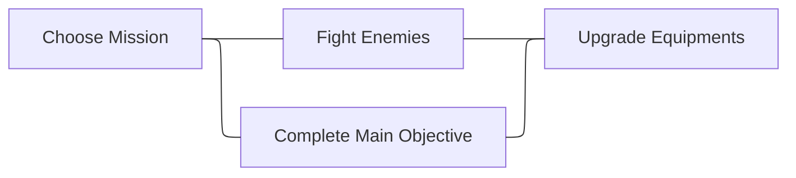

import Image from '@theme/IdealImage';
import Tabs from '@theme/Tabs';
import TabItem from '@theme/TabItem';

# Introduction

## Definition

_<ProjectTitle/>_ is a first-person multiplayer action rpg dungeon crawler. 
Players cooperate to fight enemies, unlock secrets, gather materials to upgrade 
their characters, and clear dungeon missions.

The game blends the challenging directional aiming combat - like _Mordhau_ and 
_Chilvary_ - with interesting RPG classes like in _Warhammer: Vermintide 2_.

<Image img={require("./assets/mordhau-intro.png")} alt={"Screenshot from Mordhau."}/>
[_Mordhau_](https://store.steampowered.com/app/629760/MORDHAU/).

<Image img={require("./assets/vermintide-intro.png")} alt={"Screenshot from Vermintide"}/>
[_Warhammer: Vermintide 2_](https://store.steampowered.com/app/552500/Warhammer_Vermintide_2/).

## Design Pillars: What is Central to the Experience?

We use design pillars to focus our design choices as we move through the project.
For the purpose of this project, we want our design pillars to identify the types
of fun or enjoyment which are key to the player experience.

<Tabs>
  <TabItem value="immersion" label="Immersion" default>
    Immersion will come from the camera perspective and the setting that resonates 
    with a lot of people. 

    Adding the fantasy aspect to it, also promotes escaping from reality.
  </TabItem>
  <TabItem value="fellowship" label="Fellowship">
    Cooperative mechanics will make players feel part of a bigger community
    and help each other throughout the game.
  </TabItem>
  <TabItem value="challenge" label="Challenge">
    Players make meaningful decisions to overcome challenges and gain mastery 
    over time to overcome increasingly difficult obstacles.
  </TabItem>
</Tabs>

## Audience and Market

The game is designed to be played online with other players via Steam and other
stores if successful. A single-player mode, where the allies are bots, should 
also be added in later stages.

The other games that "tick the boxes" were launched many years ago, and this new
twist of the combat and different RPG elements (compared to Vermintide) has 
potential to take a slice of the market. It will be aimed at a teen-adult audience.'

## Core Gameplay

The player moves their character around the game by using traditional First Person
Controls for moving and changing directions according to where it's looking at 
with mouse or gamepad.

Players can select a initial weapon, which can be changed at any time, and head
into missions to face enemies, solve puzzles and complete a mission-specific 
objective.

By looting resources in the environment and dropped by enemies, players can enhance
their equipment or craft new ones, with a new effects and upgraded stats.

### Core Loop

