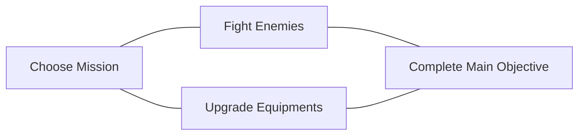

import Image from '@theme/IdealImage';
import Tabs from '@theme/Tabs';
import TabItem from '@theme/TabItem';

# Introduction

## Definition

_<ProjectTitle/>_ is a first-person multiplayer action rpg dungeon crawler. 
Players cooperate to fight enemies, unlock secrets, gather materials to upgrade 
their characters, and clear dungeon missions.

The game blends the challenging directional aiming combat - like _Mordhau_ and 
_Chilvary_ - with interesting RPG classes like in _Warhammer: Vermintide 2_.

<Image img={require("./assets/mordhau-intro.png")} alt={"Screenshot from Mordhau."}/>
[_Mordhau_](https://store.steampowered.com/app/629760/MORDHAU/).

<Image img={require("./assets/vermintide-intro.png")} alt={"Screenshot from Vermintide"}/>
[_Warhammer: Vermintide 2_](https://store.steampowered.com/app/552500/Warhammer_Vermintide_2/).

## Design Pillars: What is Central to the Experience?

We use design pillars to focus our design choices as we move through the project.
For the purpose of this project, we want our design pillars to identify the types
of fun or enjoyment which are key to the player experience.

<Tabs>
  <TabItem value="immersion" label="Immersion" default>
    Immersion will come from the camera perspective and the setting that resonates 
    with a lot of people. 

    Adding the fantasy aspect to it, also promotes escaping from reality.
  </TabItem>
  <TabItem value="fellowship" label="Fellowship">
    Cooperative mechanics will make players feel part of a bigger community
    and help each other throughout the game.
  </TabItem>
  <TabItem value="challenge" label="Challenge">
    Players make meaningful decisions to overcome challenges and gain mastery 
    over time to overcome increasingly difficult obstacles.
  </TabItem>
</Tabs>

## Audience and Market

The game is designed to be played online with other players via Steam and other
stores if successful. A single-player mode, where the allies are bots, should 
also be added in later stages.

The other games that "tick the boxes" were launched many years ago, and this new
twist of the combat and different RPG elements (compared to Vermintide) has 
potential to take a slice of the market. It will be aimed at a teen-adult audience.

## Gameplay

The player moves their character around the game by using traditional First Person
Controls for moving and changing directions according to where it's looking at 
with mouse or gamepad.

Players can select a initial weapon, which can be changed at any time, and head
into missions to face enemies, solve puzzles and complete a mission-specific 
objective.

By looting resources in the environment and dropped by enemies, players can enhance
their equipment or craft new ones, with a new effects and upgraded stats.

### Core Loop

### Balance & Pacing

The game is a linear dungeon crawler and levels can be played in increasing
difficulties, generating more replayability and supporting more casual players
in easier difficulties. 

Enemies scale in number, reasoning, timing and variety of attacks
according to the difficulty. This is a game where difficult enemies *will not* 
simply one-shot players. 

The challenge of the encounters is what define the pacing and encourages players
to play together. It will also include a downed-revive mechanic to reinforce 
even further that players need to progress together.

Other mechanics like cooperative puzzles, that require two players to be completed
like opening a big door, can also be employed for better defining pace.

## Design and Art Style

While not fully defined yet, it needs to be simple and easy to read, with not
too many screen elements to promote immersion. For this same reason, it cannot
be way too stylized, and has to provide a level of realism even if we go for a
lower poly-count.

Due to frame budget and targets, it cannot be high-poly, and we-re aiming to
support high refresh rate monitors, for the fast nature of first-person shooters,
so the art style needs to be optimizable for 1080p@144fps in mid-end computers.

This is the same train of thought used in games like 
[_Valorant_](https://www.inverse.com/gaming/valorant-art-style-interview-moby-francke).

Thinking of that, we can define pillars for the art design:

- Simple, yet visually distinct characters and weapons
- Optimization focused using a blend of old and newer techniques
- Gameplay comes first, and art should enhance it.

## Level Design

Levels should be carefully blocked out
considering all the factors mentioned so far, providing the proper pacing and
being interesting, full of secrets for the players to explore and leverage
the game mechanics in every single encounter. 

On later stages after the vertical slice, it could be interesting to experiment
with procedural generation and discover if this can also create an engaging
experience, such as in [_Unexplored_](https://www.youtube.com/watch?v=LRp9vLk7amg).

## Tone & Aesthetics

The visual style and iconography of the game will be developed as the project
evolves.

At the time of writing, I'm particularly inclined towards Dark Fantasy, such as
in [_Dark and Darker_](https://www.youtube.com/watch?v=X8WDwzZKhXE).

## Narrative

The narrative is expanded through simple comic-style frames, similar to how
_The Witcher 3_ tells part of the story, but without scripted cutscenes. More of
the story should be told with the level design, and should be quite simple as
it's more gameplay focused.

## Business Model

This is a premium game, which users will purchase once and then own for good, 
even without DRM in stores like GoG, also providing an offline mode.

The game will be further updated with fixes, quality of life improvements, a 
free "versus" game mode and minor content updates, which can be simple things
like releasing more items/enemies with different materials and stats.

Once there's enough content, a paid DLC can be released expanding the base game
with more levels, enemies and armors.

### Funding

- We'll bootstrap the vertical slice and slowly build a community in all stages
of development, providing game keys and testing early to find the fun and problems.
- PayPal/Ko-fi will also be available for early supporters.
- With a vertical slice ready, we'll prepare a kickstarter campaign while looking
for good publisher deals and cover development costs until launch.
- Finally, a full premium release in the under-30$ category, with Kickstarter
backers and frequent playtesters getting Steam keys and/or other rewards such as
name in the credits for the %any contributors.